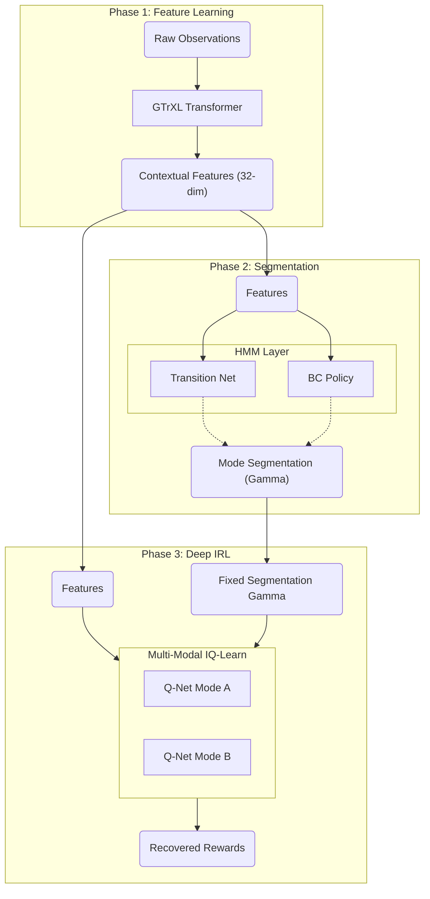

# System Architecture

```mermaid
graph TD
    subgraph Phase1 [Phase 1: Feature Learning]
        RawObs("Raw Observations")
        GTrXL["GTrXL Transformer"]
        Features("Contextual Features (32-dim)")
        
        RawObs --> GTrXL
        GTrXL --> Features
    end

    subgraph Phase2 [Phase 2: Segmentation]
        Features1("Features")
        
        subgraph HMM [HMM Layer]
            Transition["Transition Net"]
            BCPolicy["BC Policy"]
        end
        
        Segmentation("Mode Segmentation (Gamma)")
        
        Features --> Features1
        Features1 --> Transition
        Features1 --> BCPolicy
        Transition -.-> Segmentation
        BCPolicy -.-> Segmentation
    end

    subgraph Phase3 [Phase 3: Deep IRL]
        Features2("Features")
        Gamma("Fixed Segmentation Gamma")
        
        subgraph IQ [Multi-Modal IQ-Learn]
            QNet1["Q-Net Mode A"]
            QNet2["Q-Net Mode B"]
        end
        
        Rewards("Recovered Rewards")
        
        Features --> Features2
        Segmentation --> Gamma
        Features2 --> IQ
        Gamma --> IQ
        IQ --> Rewards
    end
```
