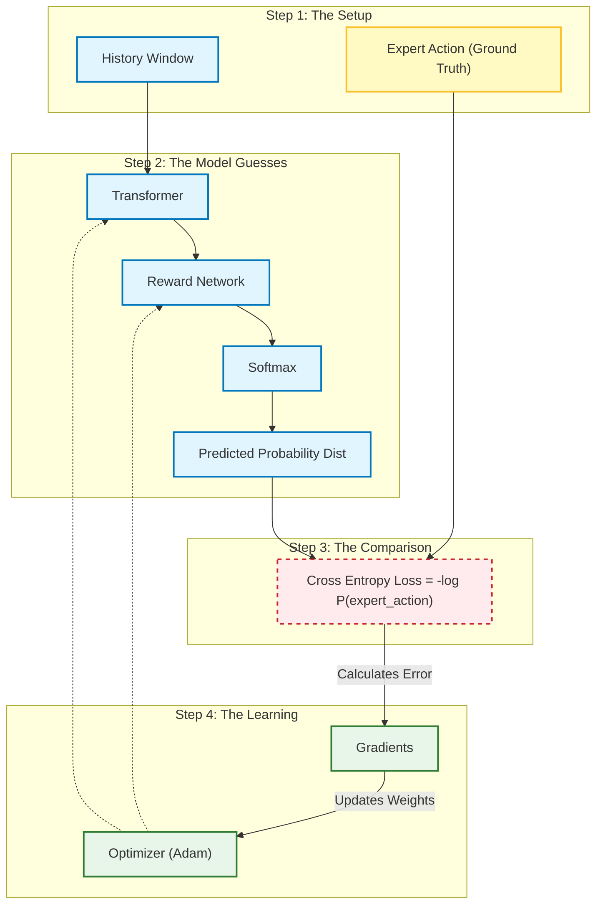

```mermaid
flowchart TD
    %% Styles
    classDef expert fill:#fff9c4,stroke:#fbc02d,stroke-width:2px;
    classDef model fill:#e1f5fe,stroke:#0277bd,stroke-width:2px;
    classDef loss fill:#ffebee,stroke:#c62828,stroke-width:2px,stroke-dasharray: 5 5;
    classDef grad fill:#e8f5e9,stroke:#2e7d32,stroke-width:2px;

    %% 1. The Inputs
    subgraph INPUTS ["Step 1: The Setup"]
        HISTORY["History Window"]:::model
        EXPERT_ACT["Expert Action (Ground Truth)"]:::expert
    end

    %% 2. The Forward Pass
    subgraph FORWARD ["Step 2: The Model Guesses"]
        TRANS["Transformer"]:::model
        R_NET["Reward Network"]:::model
        SOFTMAX["Softmax"]:::model

        PRED_DIST["Predicted Probability Dist"]:::model

        HISTORY --> TRANS --> R_NET --> SOFTMAX --> PRED_DIST
    end

    %% 3. The Loss Calculation
    subgraph LOSS_CALC ["Step 3: The Comparison"]
        LOSS_FUNC["Cross Entropy Loss = -log P(expert_action)"]:::loss

        PRED_DIST --> LOSS_FUNC
        EXPERT_ACT --> LOSS_FUNC
    end

    %% 4. Backpropagation
    subgraph BACKPROP ["Step 4: The Learning"]
        GRADIENT["Gradients"]:::grad
        OPTIMIZER["Optimizer (Adam)"]:::grad

        LOSS_FUNC --"Calculates Error"--> GRADIENT
        GRADIENT --"Updates Weights"--> OPTIMIZER

        %% The Update Arrows
        OPTIMIZER -.-> R_NET
        OPTIMIZER -.-> TRANS
    end
```
