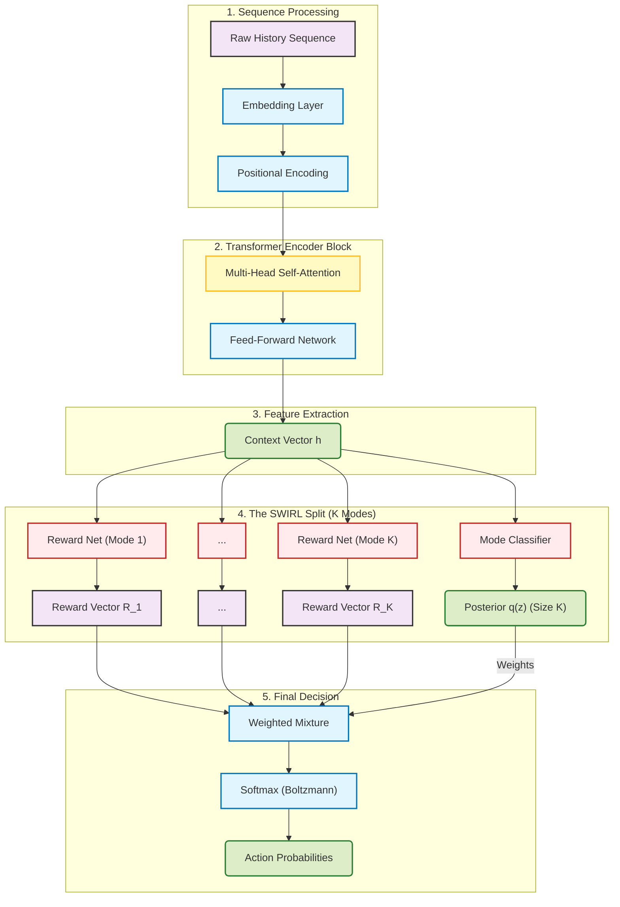

# Detail View: The Forward Pass (K Modes)

```mermaid
flowchart TD
    %% Styles
    classDef input fill:#f3e5f5,stroke:#333,stroke-width:2px;
    classDef encoder fill:#e1f5fe,stroke:#0277bd,stroke-width:2px;
    classDef attn fill:#fff9c4,stroke:#fbc02d,stroke-width:2px;
    classDef vector fill:#dcedc8,stroke:#2e7d32,stroke-width:2px,rx:5,ry:5;
    classDef logic fill:#ffebee,stroke:#c62828,stroke-width:2px;

    %% 1. INPUT PROCESSING
    subgraph INPUTS ["1. Sequence Processing"]
        direction TB
        SEQ["Raw History Sequence"]:::input
        EMBED["Embedding Layer"]:::encoder
        POS_ENC["Positional Encoding"]:::encoder

        SEQ --> EMBED --> POS_ENC
    end

    %% 2. THE TRANSFORMER CORE
    subgraph TRANSFORMER ["2. Transformer Encoder Block"]
        direction TB
        ATTN["Multi-Head Self-Attention"]:::attn
        FFN["Feed-Forward Network"]:::encoder

        POS_ENC --> ATTN
        ATTN --> FFN
    end

    %% 3. THE BOTTLENECK
    subgraph BOTTLENECK ["3. Feature Extraction"]
        CONTEXT["Context Vector h"]:::vector
        FFN --> CONTEXT
    end

    %% 4. THE SWIRL BRANCH (K MODES)
    subgraph SWIRL_LOGIC ["4. The SWIRL Split (K Modes)"]
        direction TB

        %% Branch A: Mode Inference
        CLASSIFIER["Mode Classifier"]:::logic
        MODE_PROB["Posterior q(z) (Size K)"]:::vector

        %% Branch B: Reward Functions
        R_NET_1["Reward Net (Mode 1)"]:::logic
        R_VAL_1["Reward Vector R_1"]:::input

        R_NET_DOTS["..."]:::logic
        R_VAL_DOTS["..."]:::input

        R_NET_K["Reward Net (Mode K)"]:::logic
        R_VAL_K["Reward Vector R_K"]:::input

        %% Connections
        CONTEXT --> CLASSIFIER --> MODE_PROB

        CONTEXT --> R_NET_1 --> R_VAL_1
        CONTEXT --> R_NET_DOTS --> R_VAL_DOTS
        CONTEXT --> R_NET_K --> R_VAL_K
    end

    %% 5. AGGREGATION
    subgraph OUTPUT ["5. Final Decision"]
        WEIGHTED_SUM["Weighted Mixture"]:::encoder
        SOFTMAX["Softmax (Boltzmann)"]:::encoder
        FINAL_PROB["Action Probabilities"]:::vector

        R_VAL_1 --> WEIGHTED_SUM
        R_VAL_DOTS --> WEIGHTED_SUM
        R_VAL_K --> WEIGHTED_SUM

        MODE_PROB --"Weights"--> WEIGHTED_SUM

        WEIGHTED_SUM --> SOFTMAX --> FINAL_PROB
    end
```
